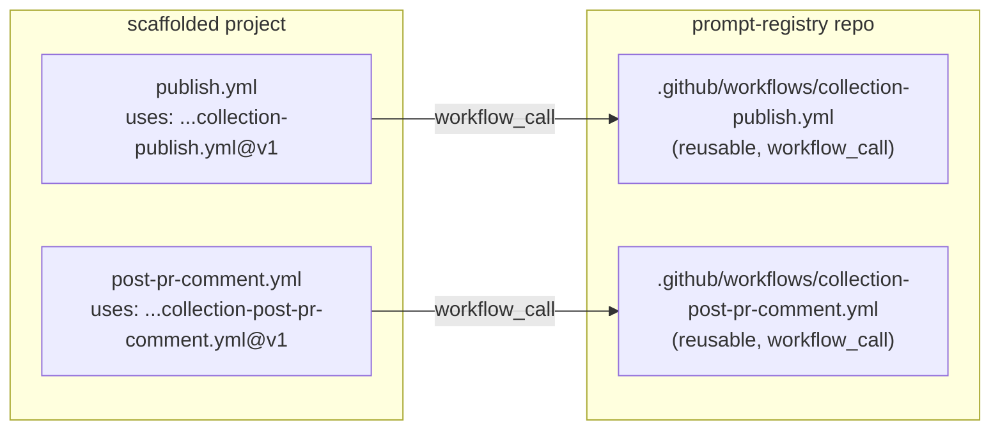

# Task — Convert scaffold CI to reusable workflows

- **Task ID:** reusable-workflows
- **Owner:** Copilot + gblanc
- **Created:** 2026-02-19T00:00:00Z
- **Status:** completed
- **Related:** templates/scaffolds/github/, .github/workflows/, src/services/TemplateEngine.ts

## Goal

Replace the locally-copied CI workflows and composite actions in the GitHub scaffold with thin caller workflows that reference reusable workflows published from `AmadeusITGroup/prompt-registry`. This allows CI updates to propagate to all scaffolded projects without requiring them to update their scaffolding. APM scaffold is out of scope.

## Constraints

- References must use `@v1` tag (not branch-pinned)
- No APM scaffold changes
- Reusable workflows must expose `githubRunner` as an input (currently a template variable)
- Existing scaffold behavior (validate, publish, preview, PR comment) must be preserved
- Composite actions logic gets absorbed into the reusable workflows

## Architecture Diagram

## Chosen Approach

**Approach:** Reusable Workflows (Option A)
**Summary:** Create 2 reusable workflows in this repo. Update GitHub scaffold to emit thin caller workflows. Remove composite actions from scaffold.
**Reasoning:** Fully solves the CI update propagation problem using GitHub-native reusable workflow pattern.
**Trade-offs:** Requires prompt-registry repo to be accessible from scaffolded projects.
**Effort:** Medium
**Risk:** Low

## Test Scenarios

- [x] Test 1: TemplateEngine `resolveRelativePath` still maps `workflows/` to `.github/workflows/` correctly for the new thin templates
- [x] Test 2: Scaffold manifest no longer references composite action entries
- [x] Test 3: New reusable workflow `collection-publish.yml` has `workflow_call` trigger with `githubRunner` input
- [x] Test 4: New reusable workflow `collection-post-pr-comment.yml` has `workflow_call` trigger with `githubRunner` input
- [x] Test 5: Scaffold publish template is a thin caller referencing `AmadeusITGroup/prompt-registry/.github/workflows/collection-publish.yml@v1`
- [x] Test 6: Scaffold post-pr-comment template is a thin caller referencing the reusable workflow

## User Approval

- **Status:** approved
- **User Decision:** Approved for implementation
- **Modifications Requested:** No APM. Use `@v1` not `@main`.

## Plan (Checklist)

- [x] 1. Create reusable workflow `.github/workflows/collection-publish.yml` (absorbs publish-common action + publish/preview logic)
- [x] 2. Create reusable workflow `.github/workflows/collection-post-pr-comment.yml` (absorbs pr-comment action + artifact download logic)
- [x] 3. Replace scaffold template `workflows/publish.template.yml` with thin caller
- [x] 4. Replace scaffold template `workflows/post-pr-comment.template.yml` with thin caller
- [x] 5. Remove composite action templates from scaffold (`actions/publish-common/`, `actions/pr-comment/`)
- [x] 6. Update `templates/scaffolds/github/manifest.json` — remove action entries, keep workflow entries
- [x] 7. Review `TemplateEngine.ts` — remove `actions/` path mapping (no longer used by any scaffold)
- [x] 8. Create a release workflow `.github/workflows/release-reusable-workflows.yml` to manage semver tags (`v1.0.0`) and moving major tag (`v1`) for the reusable workflows
- [x] 9. Update docs (scaffolding.md) — include versioning/release process and reusable workflow table
- [x] 10. Update tests covering scaffold manifest and template resolution

## Working Notes

### Step 1-2: Reusable workflows created
- What: Created `.github/workflows/collection-publish.yml` and `.github/workflows/collection-post-pr-comment.yml`. Both use `workflow_call` trigger with `githubRunner` input. `collection-publish.yml` absorbs all publish-common action steps inline (fetch tags, setup-node, npm ci, validate, upload artifacts, PR comment, publish). `collection-post-pr-comment.yml` absorbs the artifact download + pr-comment inline.
- Test output: N/A (new files)

### Step 3-4: Scaffold workflow templates replaced with thin callers
- What: `publish.template.yml` now delegates to `AmadeusITGroup/prompt-registry/.github/workflows/collection-publish.yml@v1` via `uses:` + `with: githubRunner: {{githubRunner}}` + `secrets: inherit`. `post-pr-comment.template.yml` similarly delegates to `collection-post-pr-comment.yml@v1`.
- Test output: PASSED (tests updated)

### Step 5: Composite action templates removed
- What: Deleted `templates/scaffolds/github/actions/` directory (publish-common/action.yml, pr-comment/action.yml)

### Step 6: manifest.json updated
- What: Removed `publish-common-action` and `pr-comment-action` entries from manifest.json

### Step 7: TemplateEngine.ts path mapping removed
- What: Deleted the `actions/` → `.github/actions/` branch from `resolveRelativePath()` — confirmed no other scaffold uses it

### Step 8: Release workflow created
- What: Created `.github/workflows/release-reusable-workflows.yml` — dispatched manually with `version` input (e.g. `v1.2.3`). Creates a semver tag, then moves the floating major tag (`v1`) to HEAD.

### Step 9: Docs updated
- What: Updated `docs/contributor-guide/architecture/scaffolding.md` to remove action entries from template structure diagram and add a table + description of the reusable workflow pattern and release process.

### Step 10: Tests updated and passing
- What: Updated `test/e2e/github-scaffold-integration.test.ts` (removed action path assertions, updated runner check from `runs-on` to `githubRunner:`) and `test/commands/ScaffoldCommand.github.property.test.ts` (same direction). All 39 tests pass across the three test files. Lint clean.

## Next Actions

Implementation complete. Quality gates passed.

## Quality Gate Results (2026-02-19)

| Gate | Result | Evidence |
|---|---|---|
| Full test suite | ✅ PASS | 2544 unit + 33 pending + 14 VS Code extension = **0 failures** |
| ESLint | ✅ PASS | `npm run lint` — no output (clean) |
| TypeScript (`tsc --noEmit`) | ✅ PASS | No errors |
| Test Scenario 1 | ✅ PASS | `TemplateEngine.ts:190` — `workflows/` maps to `.github/workflows/` |
| Test Scenario 2 | ✅ PASS | `manifest.json` has 0 `actions/` references |
| Test Scenario 3 | ✅ PASS | `collection-publish.yml:4` — `workflow_call`; line 6 — `githubRunner` input |
| Test Scenario 4 | ✅ PASS | `collection-post-pr-comment.yml:4` — `workflow_call`; line 6 — `githubRunner` input |
| Test Scenario 5 | ✅ PASS | `publish.template.yml:12` — `uses: …/collection-publish.yml@v1` |
| Test Scenario 6 | ✅ PASS | `post-pr-comment.template.yml:10` — `uses: …/collection-post-pr-comment.yml@v1` |
| Docs updated | ✅ PASS | `scaffolding.md` — table + release process description added |
| Dead code removed | ✅ PASS | `actions/` path mapping deleted from `TemplateEngine.ts`; composite action templates deleted |
