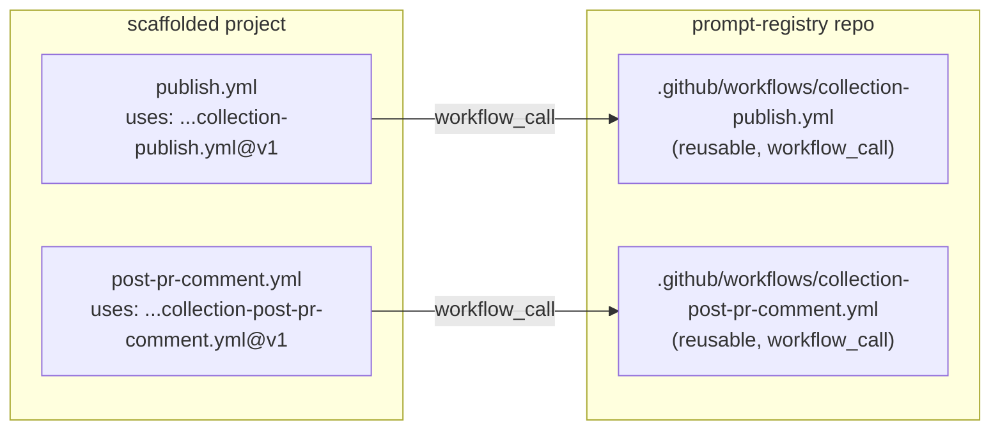

# Task — Convert scaffold CI to reusable workflows

- **Task ID:** reusable-workflows
- **Owner:** Copilot + gblanc
- **Created:** 2026-02-19T00:00:00Z
- **Status:** awaiting_approval
- **Related:** templates/scaffolds/github/, .github/workflows/, src/services/TemplateEngine.ts

## Goal

Replace the locally-copied CI workflows and composite actions in the GitHub scaffold with thin caller workflows that reference reusable workflows published from `AmadeusITGroup/prompt-registry`. This allows CI updates to propagate to all scaffolded projects without requiring them to update their scaffolding. APM scaffold is out of scope.

## Constraints

- References must use `@v1` tag (not branch-pinned)
- No APM scaffold changes
- Reusable workflows must expose `githubRunner` as an input (currently a template variable)
- Existing scaffold behavior (validate, publish, preview, PR comment) must be preserved
- Composite actions logic gets absorbed into the reusable workflows

## Architecture Diagram

## Chosen Approach

**Approach:** Reusable Workflows (Option A)
**Summary:** Create 2 reusable workflows in this repo. Update GitHub scaffold to emit thin caller workflows. Remove composite actions from scaffold.
**Reasoning:** Fully solves the CI update propagation problem using GitHub-native reusable workflow pattern.
**Trade-offs:** Requires prompt-registry repo to be accessible from scaffolded projects.
**Effort:** Medium
**Risk:** Low

## Test Scenarios

- [ ] Test 1: TemplateEngine `resolveRelativePath` still maps `workflows/` to `.github/workflows/` correctly for the new thin templates
- [ ] Test 2: Scaffold manifest no longer references composite action entries
- [ ] Test 3: New reusable workflow `collection-publish.yml` has `workflow_call` trigger with `githubRunner` input
- [ ] Test 4: New reusable workflow `collection-post-pr-comment.yml` has `workflow_call` trigger with `githubRunner` input
- [ ] Test 5: Scaffold publish template is a thin caller referencing `AmadeusITGroup/prompt-registry/.github/workflows/collection-publish.yml@v1`
- [ ] Test 6: Scaffold post-pr-comment template is a thin caller referencing the reusable workflow

## User Approval

- **Status:** pending
- **User Decision:**
- **Modifications Requested:** No APM. Use `@v1` not `@main`.

## Plan (Checklist)

- [ ] 1. Create reusable workflow `.github/workflows/collection-publish.yml` (absorbs publish-common action + publish/preview logic)
- [ ] 2. Create reusable workflow `.github/workflows/collection-post-pr-comment.yml` (absorbs pr-comment action + artifact download logic)
- [ ] 3. Replace scaffold template `workflows/publish.template.yml` with thin caller
- [ ] 4. Replace scaffold template `workflows/post-pr-comment.template.yml` with thin caller
- [ ] 5. Remove composite action templates from scaffold (`actions/publish-common/`, `actions/pr-comment/`)
- [ ] 6. Update `templates/scaffolds/github/manifest.json` — remove action entries, keep workflow entries
- [ ] 7. Review `TemplateEngine.ts` — remove `actions/` path mapping if no longer needed by any scaffold
- [ ] 8. Create a release workflow `.github/workflows/release-reusable-workflows.yml` to manage semver tags (`v1.0.0`) and moving major tag (`v1`) for the reusable workflows
- [ ] 9. Update docs (scaffolding.md, publishing.md) — include versioning/release process
- [ ] 10. Update tests if any cover scaffold manifest or template resolution

## Working Notes

## Next Actions

1. Await user approval
2. Start with creating the reusable workflows
