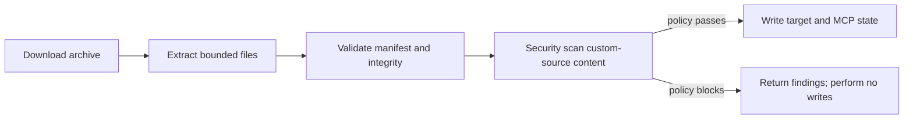

# ADR-0008: Native Ports-and-Adapters Security Scanning

**Status:** Accepted

## Context

AI Primitives Hub needs static security analysis for Markdown-based AI artifacts:
prompts, instructions, agents, skills, hooks, and supported Claude configuration
files. The behavioral reference for this work is **MD Security Scanner**, an
internal Amadeus tool that is not publicly disclosed and is not a project
dependency. Its use here is limited to an approved internal behavioral baseline;
this repository does not redistribute its source, imply public source
availability, or link to internal URLs. Shipped code is the independently
maintained native implementation described by this ADR.

The feature must be delivered through the CLI first, reused by the VS Code
extension, and later consumed from GitHub Actions through the CLI. A separate
implementation in each delivery layer would reproduce the architectural defect
addressed by ADR-0001. At the same time, scanning untrusted repositories has
security-specific requirements: no artifact execution, no network access, no
symlink traversal, bounded resource use, safe report writes, and no accidental
credential disclosure.

The scanner also needs to remain replaceable. A future engine may use a
specialized implementation, but delivery layers must continue to consume one
normalized application contract.

## Decision

1. **Treat security scanning as a cohesive bounded context in the existing
   packages.** Do not create a delivery-specific scanner or a fifth layer.

2. **Define core-owned ports and normalized contracts.** `core` owns the
   `SecurityScanEngine`, `SecurityScanInput`, and `SecurityReportStore` ports,
   security document/finding/result types, severity and policy semantics,
   suppression behavior, legacy fingerprint algorithms, and pure detection
   rules. `app` owns the `SecurityScanUseCase` and orchestration. Dependencies
   continue to point inward:

   ```mermaid
   flowchart LR
       CLI["CLI"] --> APP["app: scan use case"]
       EXT["VS Code extension"] --> APP
       GHA["GitHub Actions"] --> CLI
       APP --> CORE["core: domain, rules, ports"]
       APP --> INFRA["infra: I/O and isolation adapters"]
       INFRA --> CORE
   ```

3. **Ship a native TypeScript rule engine.** The default engine runs in Node
   without Python, network services, or repository-provided plugins. It is
   versioned separately from the rule pack and reports the rule-pack digest.
   Detection rules remain pure domain behavior; infrastructure may wrap the
   engine in an interruptible worker boundary because synchronous JavaScript
   regular expressions cannot be cancelled from the calling thread.

4. **Keep filesystem and persistence behavior in infrastructure.** The Node
   input adapter uses bounded reads, `lstat`/containment checks, deterministic
   traversal, hierarchical `.markdown.ignore` and `.markdown-file.ignore`
   loading, and explicit `repository`, `none`, or `baseline` ignore trust.
   The report adapter performs bounded, owner-only, no-follow, atomic writes.

5. **Preserve useful reference compatibility without copying unsafe defaults.**
   The integrated scanner preserves the `.markdown.ignore` and
   `.markdown-file.ignore` formats and legacy exact/canonical fingerprint
   fields. It intentionally differs from the reference where required for
   safety and integration: native runtime, `.md`/`.markdown` default scope,
   no-follow traversal, bounded work, redacted secret evidence, opt-in reports,
   explicit policy exits, and fail-closed CI mode.

6. **Use the application result in every delivery mechanism.** The CLI exposes
   `ai-primitives-hub security scan`; the extension delegates to the same app
   capability and owns only trusted-workspace lifecycle, debounce, cancellation,
   diagnostics, and notifications. GitHub Actions invoke a pinned released
   CLI with `--ci` and `--ignore-trust none`; PR comments and SARIF are separate
   delivery concerns, not scanner-core behavior.

7. **Maintain the rule pack through reviewed, incremental updates.** The
   approved internal MD Security Scanner `1.10.9` behavior is the initial parity
   baseline. Rule families are migrated and tested incrementally. Every
   intentional difference receives a parity/deviation record, and the private
   source provenance, modifications, mappings, remediation, and tests remain
   traceable to authorized maintainers. The internal tool and its source are not
   redistributed or made public by this project; public code contains only the
   independently maintained implementation and approved behavior.

8. **Plan a security gate in the installation pipeline.** The current scanner
   delivery is CLI/VS Code focused, but the intended application architecture
   includes an optional, policy-controlled scan of extracted bundle content
   after archive/manifest validation and before any target or MCP write. The
   gate must scan custom-source content as untrusted input, use the existing
   normalized scan contract, preserve bounded/no-execution guarantees, and
   return findings before side effects occur. Initial rollout may support
   report-only or warning policy while policy defaults and UX are validated;
   enabling the gate must not silently weaken existing installation checks.

## Consequences

- **Positive:** CLI and VS Code share one scan pipeline and one finding contract;
  a future delivery mechanism or engine can be added without duplicating rule
  behavior.
- **Positive:** untrusted repository scanning has explicit containment,
  resource, cancellation, ignore-trust, report, and redaction boundaries.
- **Positive:** existing users can continue using the established suppression
  files and fingerprint values while CI can disable repository-controlled
  suppressions.
- **Positive:** rule-pack updates are versioned, testable, and reviewable rather
  than hidden inside a delivery adapter.
- **Positive:** a future pre-write installation gate can protect users from
  ungoverned custom sources without coupling installation to a particular
  scanner implementation or giving the scanner permission to execute content.
- **Negative:** the core security package contains a substantial pure rule
  implementation and requires careful ReDoS/resource review.
- **Negative:** worker isolation and VSIX/CLI packaging must be tested together;
  a missing worker artifact must fail safely rather than silently removing the
  deadline guarantee.
- **Negative:** compatibility is behavioral rather than byte-for-byte source
  compatibility. Report schema, exit policy, default discovery, and evidence
  safety must be documented when they differ.

## Implementation implications

The initial implementation is organized as:

```text
packages/core/src/domain/security/
packages/core/src/ports/security-scan-*.ts
packages/core/src/ports/security-report-store.ts
packages/infra/src/security/
packages/app/src/security/
packages/cli/src/commands/security-scan.ts
apps/vscode-extension/src/services/security-scan-service.ts
```

The intended future installation integration is:



The scan stage is deliberately before target and MCP side effects. It is a
planned integration point, not a claim that every current installation path
already invokes the scanner.

Required verification includes:

- pure core rule, parser, fingerprint, suppression, and policy tests;
- infra symlink, containment, limit, worker, and atomic-write tests;
- app orchestration and incomplete-result tests;
- CLI argv, structured-output, report, CI-trust, and exit-code tests;
- extension trust, debounce, cancellation, diagnostics, and package tests;
- differential vectors against the frozen reference where the feature parity
  manifest identifies a compatible rule variant;
- documentation and release-gate updates for rule-pack changes.

This ADR does not decide whether to add a remote rule-pack update channel,
SARIF output, dynamic red teaming, or automatic remediation. Each would require
an additional design decision if introduced.
