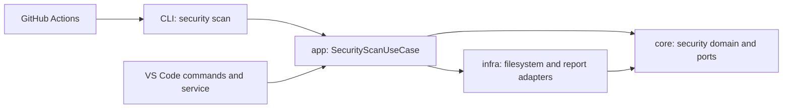
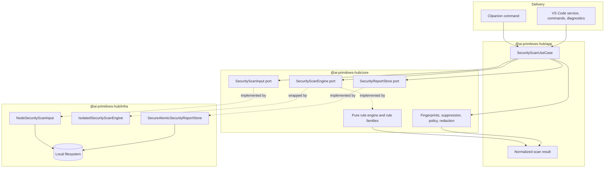
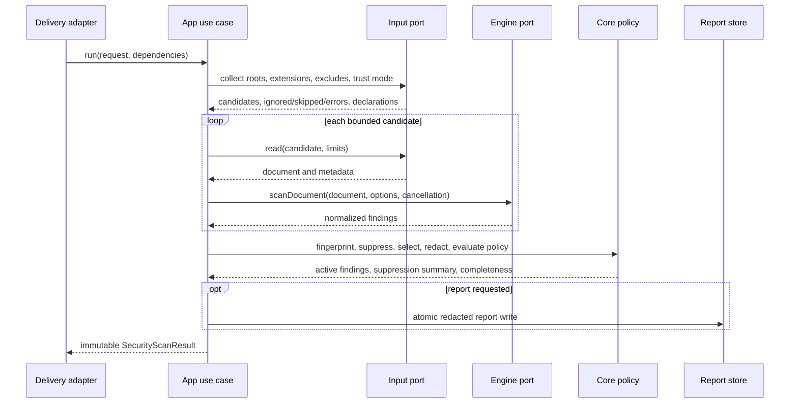
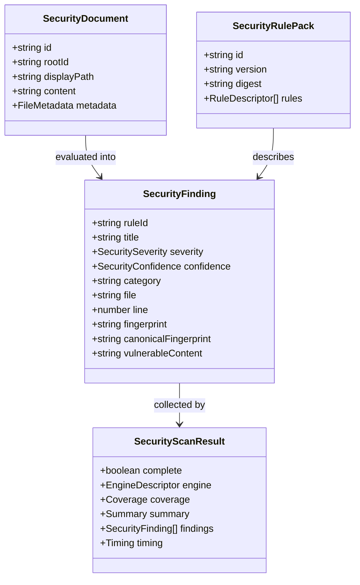

# Security Scanner Architecture

The security scanner is a cohesive bounded context inside the existing AI Primitives Hub packages. It is not a delivery-specific linter and it does not introduce a fifth architectural layer.

## Dependency direction



The existing package dependency direction remains authoritative:

```text
CLI / Extension → app → infra → core
```

`core` does not import `vscode`, `node:fs`, process execution, or network clients. `infra` implements external capabilities. `app` composes and orchestrates. Delivery layers translate user interaction and presentation only.

## Components



## Scan flow



The input adapter never executes candidate content. Directory traversal uses `lstat`, rejects symbolic links/special files, enforces containment and size/depth limits, and sorts candidates deterministically. Report storage uses owner-only temporary files and atomic replacement.

## Ports and responsibilities

### `SecurityScanInput`

Core owns the interface. The Node adapter supplies bounded filesystem discovery and reads. An editor-buffer adapter can be added later without changing rule logic. The input result partitions candidates into scanned, ignored, skipped, and error states.

### `SecurityScanEngine`

Core owns the engine contract and the pure built-in rule behavior. The engine descriptor reports its ID, implementation version, rule-pack version, and digest. Alternative engines must normalize into the same finding model and explicitly declare capabilities.

The CLI composes the built-in engine behind `IsolatedSecurityScanEngine`. The worker boundary is required because synchronous JavaScript regular expressions cannot be interrupted from the calling thread. A timeout or cancellation produces an incomplete scan.

### `SecurityReportStore`

Core owns a narrow persistence intent contract. Infra enforces no-follow destination checks, bounded writes, exclusive owner-only temporary creation, atomic rename, and overwrite policy. Report rendering must not leak raw secret evidence.

## Domain model



Legacy fingerprints remain compatible with MD Security Scanner. A stronger identity may be added as a new field, but cannot silently replace `.markdown.ignore` compatibility keys.

## Delivery boundaries

### CLI

`packages/cli/src/commands/security-scan.ts` parses flags, composes the built-in engine/input/report adapters, invokes app once, serializes output, and maps complete/policy/incomplete outcomes to exit codes. It does not contain detection rules.

### VS Code

`apps/vscode-extension/src/services/security-scan-service.ts` delegates to app. Extension code owns command registration, settings, trusted-workspace checks, save debounce, scan cancellation, diagnostics, and notifications. New command IDs use the established lowercase `promptregistry.*` machine identity; existing historical IDs are unchanged.

### GitHub Actions

Actions consume the published CLI. The scanner itself needs no token or network access. Workflows select changed files safely, invoke `--ci --ignore-trust none`, use least-privilege permissions, and upload only redacted reports through separately reviewed artifact/reporting steps.

## Security design constraints

- artifact text, paths, frontmatter, and ignore files are untrusted data;
- no artifact execution, dynamic imports, network lookup, or repository plugin loading;
- no symbolic-link traversal by default;
- bounded files, bytes, depth, findings, report size, and duration;
- worker isolation for blocking evaluation;
- fixed `[REDACTED]` secret evidence in default sinks;
- no raw source content in errors, logs, or telemetry;
- repository ignore trust is explicit in CI;
- report/webview output is destination-escaped;
- incomplete scans cannot be reported as clean.

## Testing and maintenance

Core tests cover pure behavior and fingerprint vectors. Infra tests cover path safety and atomic persistence. App tests cover orchestration and policy. CLI tests cover argv, output, and exit contracts. Extension tests cover registration, trust, diagnostics, debounce, and cancellation.

Rule updates are made one family at a time, with a frozen reference commit, positive/negative cases, adversarial long-input cases, differential results, mapping/remediation review, and a rule-pack digest update. See the [Security Scanner Maintenance](../security-scanner-maintenance.md) guide.

## See also

- [Clean Architecture](./library-centric-architecture/clean-architecture.md)
- [Ports & Adapters ADR](./adr/0001-ports-and-adapters-for-cli-and-extension.md)
- [Security Scanner Maintenance](../security-scanner-maintenance.md)
- [Security Scanner Reference](../../reference/security-scanner.md)
