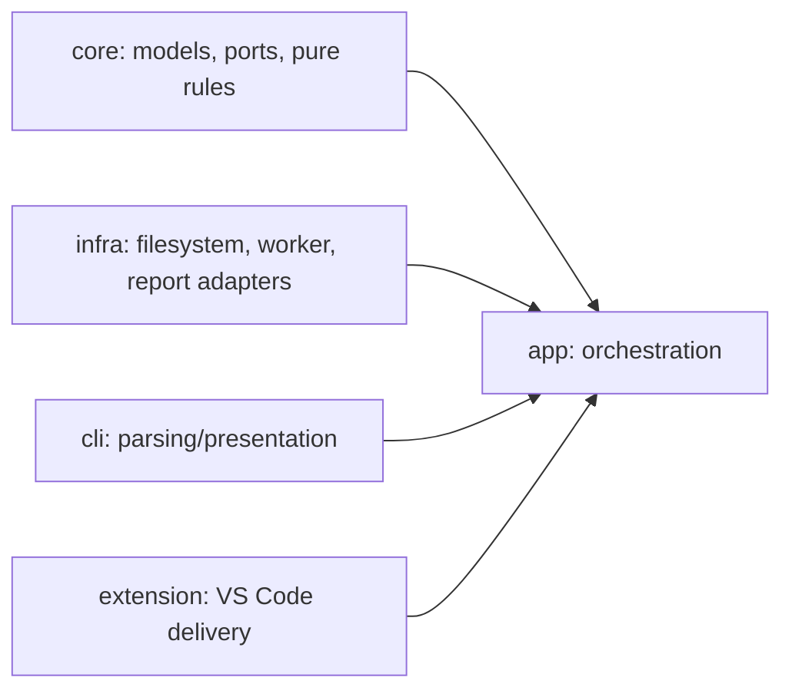
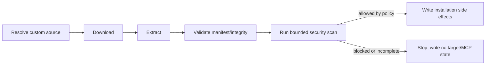

# Security Scanner Maintenance

This guide is for contributors changing rules, parsing, input discovery, reports, or delivery adapters.

## Source of truth

The behavioral baseline for this work is **MD Security Scanner `1.10.9`**, an
internal Amadeus tool that is not publicly disclosed. It is used only by
authorized maintainers as a private reference. It is not a dependency of this
repository, its source is not redistributed here, and public documentation must
not contain internal URLs or references to unavailable source locations.

The production rule pack must record in the project’s approved provenance record:

- internal baseline version and authorized provenance reference;
- imported rule-pack version and digest;
- rule IDs and variants actually present;
- material modifications;
- differential-test results;
- remediation and taxonomy references.

Do not use README rule counts as an inventory. Rule IDs such as `INJ-001` can represent multiple variants, and some numbered IDs are intentionally absent.

## Change a rule safely

1. Add a focused failing test in `packages/core/test/domain/security/`.
2. Identify whether the rule is a pure domain rule or an infrastructure concern.
3. Implement the smallest change in the security domain; do not add detection logic to CLI or extension services.
4. Add a positive case, a near-miss negative case, and an example/code-block context case where relevant.
5. Add a synthetic fake credential only; never use a live secret.
6. Check severity, confidence, location, fingerprint input, remediation, and OWASP/CWE mapping.
7. Test long nonmatching input and repetitive delimiters for regex denial-of-service behavior.
8. Run the frozen differential corpus and record every intentional difference.
9. Update the rule-pack digest/version and relevant user/reference documentation.

## Layer rules



- `core` must not import `vscode`, direct filesystem APIs, network clients, or shell execution.
- `infra` owns local traversal, file metadata, no-follow checks, worker execution, and report persistence.
- `app` owns one shared use case and does not define rule meaning.
- CLI and extension format and present shared results; they do not fork behavior.

## Installation pipeline integration

The scanner is valuable even when a source is not explicitly governed by the
project. Users can add custom sources, and bundle content may contain prompts,
skills, hooks, agent instructions, or MCP configuration that has not passed the
project’s authoring review.

The intended future integration point is after download/extraction and manifest
integrity validation, but before target files, MCP configuration, lockfiles, or
installation state are written:



This is an intended extension of `InstallPipeline`, not a claim that the
current installation implementation has already enabled the gate. The eventual
stage should consume extracted bytes through an input adapter rather than
re-reading an attacker-controlled path, and should support explicit report-only,
warning, and blocking policies. Any blocking default requires a migration and
UX decision because it can affect existing custom sources.

## Safe filesystem changes

Security scanning operates on untrusted repositories:

- use `lstat`, not `stat`, when deciding whether to traverse;
- reject symbolic links and special files unless a reviewed capability says otherwise;
- establish canonical root containment before reading;
- enforce per-file and aggregate byte limits;
- bound ignore-file size, line count, and pattern count;
- do not read or write through symlinks;
- use atomic owner-only report writes;
- keep absolute paths out of default reports and logs;
- record incomplete coverage rather than treating unreadable files as clean.

## Report and privacy rules

Default reports must not contain captured secret characters, lengths, prefixes, or suffixes. Use `[REDACTED]` for secret/credential evidence. Error and log messages must not include source excerpts.

When adding fields:

- keep JSON/YAML machine fields stable and versioned;
- escape Markdown and terminal control characters;
- avoid artifact-controlled links in webviews;
- update the JSON/NDJSON contract tests;
- consider whether the field could disclose repository paths or credentials.

## CLI and CI changes

For CLI changes, update:

- `packages/cli/src/commands/security-scan.ts`;
- command tests and output contracts;
- `docs/reference/commands.md`;
- `docs/reference/security-scanner.md`;
- GitHub Actions usage examples.

CI gates must use `--ci` and `--ignore-trust none`, unless a protected baseline is intentionally supplied. Never turn repository pull-request input into a shell command string. Keep `contents: read` as the default workflow permission.

## VS Code changes

Read `apps/vscode-extension/AGENTS.md`, `src/services/AGENTS.md`, and `test/AGENTS.md` first.

Automatic scans are allowed only for trusted local `file:` workspaces. Maintain:

- save debounce;
- one active scan per document/workspace key;
- cancellation of superseded work;
- latest-generation/document-version protection;
- stale diagnostic cleanup;
- no raw evidence in notifications, logs, or webviews;
- strict webview CSP and escaped values.

Settings belong under `promptregistry.security.*`. Do not reintroduce the standalone `md-security-scanner.*` namespace or a Python runtime dependency.

## Verification commands

Run focused tests first, then owning package checks:

```bash
pnpm -C packages/core test
pnpm -C packages/infra test
pnpm -C packages/app test
pnpm -C packages/cli test
pnpm -C packages/core build
pnpm -C packages/infra build
pnpm -C packages/app build
pnpm -C packages/cli build
pnpm -C packages -r lint:fix
pnpm -C apps/vscode-extension run compile
pnpm -C apps/vscode-extension run compile-tests
LOG_LEVEL=ERROR pnpm -C apps/vscode-extension run test:unit
pnpm -C apps/vscode-extension run package:vsix
pnpm -C website run build
```

Follow repository guidance: use `lint:fix`; do not run the corresponding non-fixing lint command afterward.

## Review checklist

- [ ] Rule family/variant and source provenance recorded
- [ ] Positive, negative, context, and adversarial tests added
- [ ] Legacy fingerprints unchanged or deviation documented
- [ ] Secret evidence redacted in every output sink
- [ ] No symlink/path escape or unbounded input behavior
- [ ] Ignore trust and CI behavior reviewed
- [ ] CLI and extension use app, with no duplicated rule logic
- [ ] Output/report schema and docs updated
- [ ] Mermaid diagrams updated for architecture/flow changes
- [ ] Core, infra, app, CLI, extension, and docs validation completed
